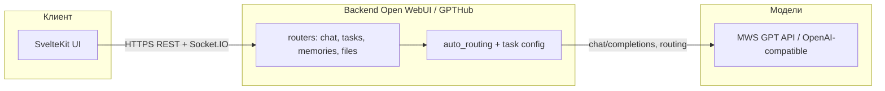
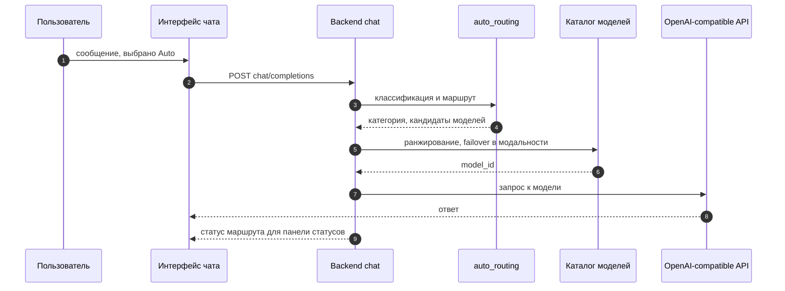
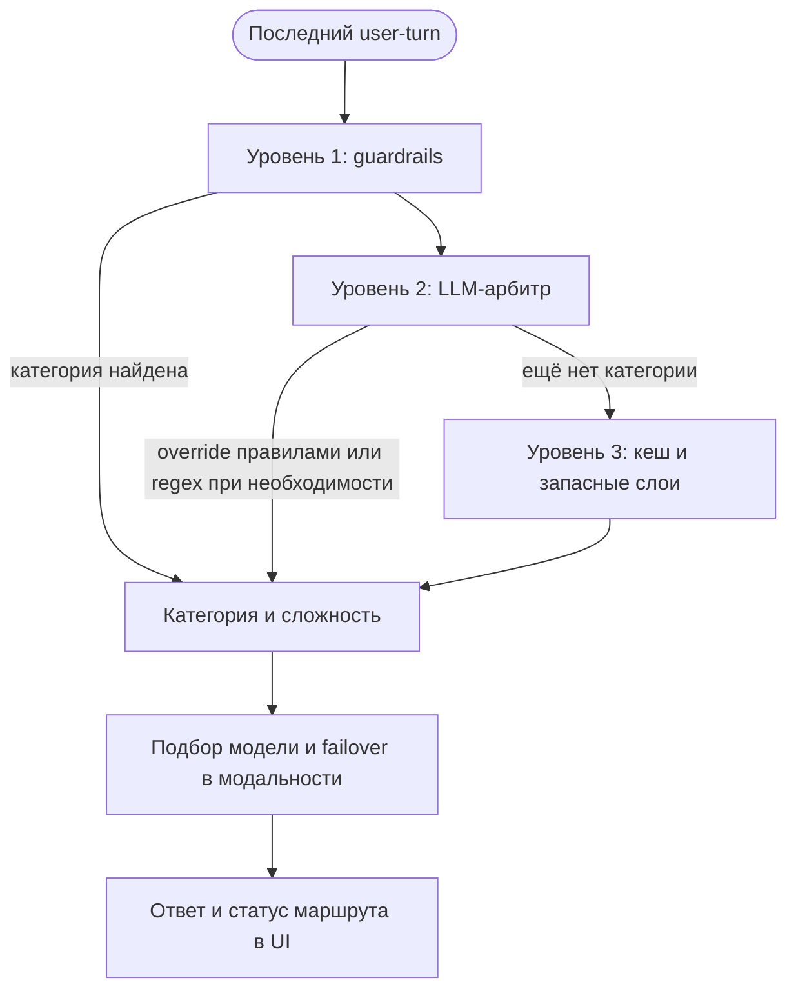
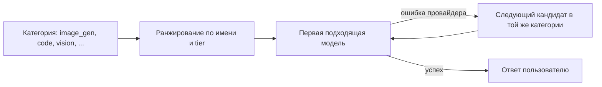

# GPTHub / VibeHub — единое ИИ-пространство

[](https://github.com/IT-AUL/true-tech-hack-2026/actions/workflows/ci.yml)
[](https://github.com/IT-AUL/true-tech-hack-2026/releases/latest)
[](https://github.com/open-webui/open-webui)
[](LICENSE)
[](https://hub.docker.com/r/itaul/gpthub)
[](#деплой-для-компаний-self-hosted)

[](https://kit.svelte.dev/)
[](https://fastapi.tiangolo.com/)
[](https://python.org/)
[](https://typescriptlang.org/)
[](https://tailwindcss.com/)

> **GitHub и GitLab.** Исходный код, задачи и CI — в репозитории **[github.com/IT-AUL/true-tech-hack-2026](https://github.com/IT-AUL/true-tech-hack-2026)**. Собранные **Docker-образы**: **[Docker Hub — itaul/gpthub](https://hub.docker.com/r/itaul/gpthub)** и **[GitHub Container Registry](https://github.com/IT-AUL/true-tech-hack-2026/pkgs/container/true-tech-hack-2026)**. Копия в **GitLab** обновляется при синхронизации ветки `main` из GitHub.

> Форк [Open WebUI](https://github.com/open-webui/open-webui), доработанный до **единого рабочего пространства с ИИ**: один интерфейс для диалогов, файлов, мультимодальных моделей и фоновых задач (титулы, теги, follow-up). Все запросы к LLM идут через **OpenAI-совместимый API** (в проде — MWS GPT и выбранные эндпоинты из конфигурации).

## Позиционирование

- **Один вход для команды** — чат, модели, память, загрузка документов и сценарии «задача → ответ» без смены отдельных инструментов.
- **Умная маршрутизация** — бэкенд классифицирует намерение и подбирает модальность (текст, код, картинка, поиск и т.д.); пользователь может оставить режим **Авто** или выбрать профиль задачи в workspace.
- **Контроль данных** — готовый **self-hosted** сценарий: образы в [GHCR](https://github.com/IT-AUL/true-tech-hack-2026/pkgs/container/true-tech-hack-2026) и на [Docker Hub](https://hub.docker.com/r/itaul/gpthub), деплой на свою инфраструктуру, ключи и `OPENAI_API_BASE_URL` только у вас.

## Архитектура (кратко)



| Слой | Роль |
|------|------|
| **Frontend (`src/`)** | SvelteKit 2, чат, подсказки в поле ввода, выбор моделей и режимов задачи, workspace. |
| **Backend (`backend/open_webui/`)** | FastAPI: прокси к моделям, `/api/v1/tasks/*` (автодополнение, теги, follow-up), память, RAG. |
| **Маршрутизация** | `utils/auto_routing.py` + конфиг задач — выбор модели под тип запроса. |
| **Данные** | SQLite по умолчанию; опционально PostgreSQL; векторное хранилище для RAG/памяти. |

### Авто-маршрутизация: схемы

Когда в чате выбрана виртуальная модель **Auto**, бэкенд сам определяет **категорию задачи** (текст, код, картинка, vision и т.д.), подбирает кандидатов из каталога и вызывает нужный сценарий (обычный чат, генерация изображения, аудио и т.п.). Подробный разбор сценариев и таблиц — в **[docs/auto-routing-presentation-brief.md](docs/auto-routing-presentation-brief.md)**.

**1. Поток запроса (упрощённо)**



**2. Классификация: три уровня и ранний выход**

Сначала срабатывают **жёсткие правила и LLM**; если категория ещё не определена, подключаются **кеш** и **запасные слои** (small-talk в диалоге, semantic, явные правила, regex). На любом шаге при успехе дальнейшая классификация не выполняется. Полный порядок ветвлений — в `backend/open_webui/utils/auto_routing.py`.



**3. От категории к ответу**



**Ссылки:** репозиторий на **[GitHub](https://github.com/IT-AUL/true-tech-hack-2026)** · образ **[Docker Hub — itaul/gpthub](https://hub.docker.com/r/itaul/gpthub)** · **[пакет GHCR](https://github.com/IT-AUL/true-tech-hack-2026/pkgs/container/true-tech-hack-2026)** · настройка копии в GitLab: [docs/GITLAB_SETUP.md](docs/GITLAB_SETUP.md).

## Инженерная зрелость

В проекте заложены практики, которые помогают поддерживать предсказуемую разработку, стабильные релизы и масштабируемую эксплуатацию.

### 1) Пайплайны в продукте и бэкенде

- **Chat processing pipeline** в бэкенде: нормализация входа, web search/image/tools/files, память, роутинг и выполнение модели в одном предсказуемом потоке.
- **Pipelines API** (`backend/open_webui/routers/pipelines.py`) позволяет подключать filter/inlet/outlet-этапы без жёсткого форка логики.
- **Auto-routing pipeline** (`backend/open_webui/utils/auto_routing.py`) с guardrails, LLM-adjudicator, semantic/cache/rules fallback и failover внутри модальности.

Для команды это означает, что новые сценарии добавляются как этапы/расширения, а не через хаотичные правки по всему коду.

### 2) Система тегов и метаданных

- На уровне задач используются **фоновые генерации** (`title_generation`, `tags_generation`, `follow_up_generation`) для структуры диалога и навигации.
- Версионирование идёт в формате **`MAJOR.MINOR.PATCH-gpthub.N`** — это прозрачная связь с upstream и форк-релизами.
- Релизные теги Git (`v0.8.12-gpthub.N`) валидируются в CI against `package.json` (`scripts/check-version-tag.mjs`) — исключаются «битые» релизы.

Практический эффект: история чатов и релизов остаётся читаемой, а процесс поставки предсказуемым.

### 3) Выкатки и надёжность поставки

- **CI** (`.github/workflows/ci.yml`): фронтенд-линт, backend-линт, backend tests, отмена устаревших прогонов (`concurrency`).
- **Release pipeline** (`.github/workflows/release.yml`): verify tag -> multi-arch build -> push в GHCR + Docker Hub -> GitHub Release из CHANGELOG.
- **Deploy Demo** (`.github/workflows/deploy-demo.yml`): ручная выкладка версии/image на стенд, проверка runtime `.env`, автоматическое обновление `WEBUI_SECRET_KEY`.

Выкатка остаётся простой и управляемой, при этом закрывает базовые контуры качества и воспроизводимости для промышленной разработки.

### 4) Оптимизация поставляемого фронтенда и стабильности

- Уменьшен стартовый фронтенд-пейлоад за счёт отложенной загрузки тяжёлых библиотек и аккуратного разделения сценариев (подход «загружаем по необходимости», а не всё сразу).
- Снижены лишние сетевые/JSON-пейлоады в административных и сервисных API (в том числе список функций возвращает только рабочий минимум метаданных).
- Закрыт ряд багов, влияющих на стабильность пользовательского сценария: от проблем стриминга/роутинга до типичных UI-залипаний и неконсистентного статуса задач.

Итог: быстрее первая отрисовка, меньше «шумных» запросов и более предсказуемое поведение интерфейса под нагрузкой.

## Отличия от базового Open WebUI

Ниже — ключевые отличия форка GPTHub/VibeHub от базового Open WebUI, собранные по истории релизов и коммитов.

### Сравнение с базовой версией

| Область | Базовый Open WebUI | GPTHub / VibeHub (форк) |
|---|---|---|
| Выбор модели в чате | Ручной выбор модели, без специализированного режима оркестрации | Виртуальная модель **`Auto`** + runtime-resolve модели по категории задачи |
| Маршрутизация задач | Общий pipeline без нашего enterprise-слоя | **Enterprise auto-routing**: guardrails -> LLM adjudicator -> semantic/cache/rules fallback + failover в модальности |
| Генерация медиа через auto-route | Возможны деградации сценария при сложных кейсах | Исправлен handoff: `image_gen`/`audio_gen` не уходит в текстовый chat-flow |
| Наблюдаемость роутинга | Базовый status | Расширенный routing status: category, method, stage, confidence, reasoning, candidate metadata |
| UX в поле ввода | Стандартные подсказки | **InlinePromptHints** (local-first + debounced LLM continuation) + **TaskRouterSelector** (Авто/Чат/Код/Поиск/Фото) |
| Отображение выбранной модели | Часто абстракция уровня режима | В ответе показывается **фактически выбранная модель**, а не только `Auto` |
| Релизная дисциплина | Общий подход upstream | Форк-версионирование `MAJOR.MINOR.PATCH-gpthub.N`, строгая проверка `tag == package.json version` |
| Контейнерная поставка | Базовые образы и релизы upstream | Публикация в **GHCR + Docker Hub**, отдельный **Deploy Demo** workflow для управляемой выкладки |

### Матрица категорий моделей (где и когда используются)

`Auto` выбирает категорию по сигналам запроса (текст, вложения, URL, контекст), затем подбирает модель из runtime-каталога с учётом failover.

| Категория route | Когда выбирается (типовой триггер) | Какой класс моделей используется |
|---|---|---|
| `fallback` | Обычный диалог, short Q&A, small-talk | Универсальные chat LLM (например `qwen`, `gpt`, `claude`, `llama`) |
| `code` | Просьбы написать/исправить код, рефакторинг, API/endpoint | Code-capable модели (`codestral`, `deepseek-coder`, `qwen3-coder`, и аналоги) |
| `vision` | Вопросы по изображению/скриншоту, OCR-сценарии | VLM/мультимодальные модели (`gpt-4o`, `gemini`, `claude vision`-класс) |
| `image_gen` | «Создай/сгенерируй картинку», промпт на генерацию изображения | Image generation модели (`gpt-image`, `flux`, `sdxl`, и аналоги) |
| `audio_gen` | «Сгенерируй музыку/звук/мелодию» | Audio generation модели (music/audio generation family) |
| `research` | Сравнение, обзор, работа с URL/внешним контентом | Reasoning/research LLM с длинным контекстом |
| `analytics` | Таблицы, CSV, метрики, BI-вопросы | Аналитические/reasoning модели с сильной структурной обработкой |
| `document` | Работа с документами: PDF, договоры, длинные тексты | Long-context/document-capable LLM |
| `math_logic` | Формулы, выводы, задачи на доказательство/логические цепочки | Модели с усиленным reasoning-профилем |

### Дополнительно по UI/UX

- Обновлён визуальный слой чата: подсказки, статусные панели, улучшенная читаемость потока ответа и источников.
- Ускорен путь «ввод -> ответ» за счёт снижения лишних клиентских вызовов и более дешёвых локальных эвристик в подсказках.
- Поведение интерфейса в длинных сессиях стало стабильнее за счёт фиксов, связанных с роутингом, стримингом и статусами задач.

## Реализация функциональных фич

Ниже — текущий статус по продуктовым требованиям. В рабочем контуре форка все обязательные сценарии покрыты.

| # | Фича | Статус | Как реализовано в проекте |
|---|---|---|---|
| 1 | Текстовый чат | Реализовано | Базовый chat-flow + расширения статусов и маршрутизации. |
| 2 | Голосовой чат | Реализовано | Voice input + STT/TTS контур через конфигурацию аудио. |
| 3 | Генерация изображений в чате | Реализовано | Категория `image_gen` и отдельный image-generation flow. |
| 4 | Аудиофайлы + автоматический ASR | Реализовано | Обработка audio/video вложений + транскрибация в pipeline. |
| 5 | Изображения (VLM) | Реализовано | Категория `vision`, анализ изображений и OCR-похожие сценарии. |
| 6 | Файлы и ответы по содержимому | Реализовано | Upload + retrieval/knowledge + ответы по документам. |
| 7 | Поиск в интернете | Реализовано | Встроенный web search через движки, включая Brave. |
| 8 | Веб-парсинг по ссылке из сообщения | Реализовано | Tool `fetch_url` и web loader в chat/tool pipeline. |
| 9 | Долгосрочная память | Реализовано | Memory tools + project memory сценарии. |
| 10 | Автовыбор модели под задачу | Реализовано | `Auto` + enterprise auto-routing с failover. |
| 11 | Ручной выбор модели | Реализовано | Model selector в UI + явный выбор режима задачи. |
| 12 | Markdown и форматированный код | Реализовано | Markdown/rich text, code blocks, улучшения стабильности рендера. |
| 13 | Deep Research / research-режим | Реализовано | Категория `research`, web search + синтез ответа по источникам. |
| 14 | Генерация презентаций | Реализовано | Практический сценарий через structured output и экспорт в markdown/слайд-формат. |
| 15 | Дополнительный функционал | Реализовано | Pipelines, tools/functions, workspace-модули, self-hosted контур. |

---

## Демо для жюри

**Сайт:** [https://mtshack.it-aul.ru](https://mtshack.it-aul.ru)

Тестовый доступ для проверки стенда (пароль рекомендуется периодически менять):

| Поле | Значение |
|------|----------|
| **Email** | `demo-admin@mtshack.it-aul.ru` |
| **Пароль** | `DemoMtshack2026!` |
| **Роль** | admin |

**Что можно потестить на стенде**

- Чат с моделью **Auto** и ручной выбор моделей из списка.
- Сценарии с картинками/файлами (если включено на сервере).
- Подсказки и автодополнение в поле ввода, follow-up и вспомогательные задачи бэкенда.
- Админские разделы (модели, пользователи — по политике стенда).

---

## Возможности продукта

- **Мультимодальный чат** — текст, голос, изображения, файлы, аудио в одном интерфейсе.
- **Авто-маршрутизация** — выбор подходящей модели (LLM / VLM / ASR / генерация изображений и т.д.).
- **Ручной выбор модели и режима задачи** — переключение в любой момент.
- **Долгосрочная память** — контекст и факты о пользователе между сессиями (при включённой памяти).
- **Веб-поиск и работа с контентом** — по настройкам инстанса.
- **Self-hosted** — развёртывание на своих мощностях.

## Быстрый старт (локально)

```bash
# Клонировать (основной репозиторий — GitHub)
git clone https://github.com/IT-AUL/true-tech-hack-2026.git
cd true-tech-hack-2026

# Подготовить переменные (шаблон для прода — deploy/.env.example)
cp deploy/.env.example .env
# Обязательно задать в .env:
#   OPENAI_API_KEY           — ключ MWS / OpenAI-совместимого API
#   OPENAI_API_BASE_URL      — например https://api.gpt.mws.ru/v1
#   WEBUI_SECRET_KEY         — случайная строка для сессий

# Запуск одной командой (подхватит .env из корня)
OPENAI_API_KEY=<your-key> docker compose -f docker-compose.dev.yml up --build
```

Приложение: **http://localhost:3000** (порт задаётся `PORT` в `.env`, по умолчанию 3000).

### Минимальный набор переменных для разработки

| Переменная | Назначение |
|------------|------------|
| `OPENAI_API_KEY` | Ключ к API моделей (обязательно). |
| `OPENAI_API_BASE_URL` | База OpenAI-совместимого API (например MWS: `https://api.gpt.mws.ru/v1`). |
| `WEBUI_SECRET_KEY` | Секрет сессий; в dev в compose есть дефолт — для публичного стенда задайте свой. |
| `ENABLE_OLLAMA_API` | `false`, если Ollama не используется (уменьшает шум в логах). |

### Примеры: Docker и настройка API

**1. Сборка из репозитория и запуск compose** (как выше, с явным `.env`):

```bash
cp deploy/.env.example .env
# Отредактируйте .env: OPENAI_API_KEY, OPENAI_API_BASE_URL, WEBUI_SECRET_KEY

docker compose -f docker-compose.dev.yml --env-file .env up --build -d
# Проверка: curl -sf http://localhost:${PORT:-3000}/health
```

**2. Готовый образ с [Docker Hub](https://hub.docker.com/r/itaul/gpthub)** (без локальной сборки):

```bash
export VERSION=latest   # или конкретный тег, например 0.8.12-gpthub.24
docker pull itaul/gpthub:${VERSION}

docker run -d --name gpthub --rm \
  -p 3000:8080 \
  -e OPENAI_API_BASE_URL=https://api.gpt.mws.ru/v1 \
  -e OPENAI_API_KEY="ваш-ключ" \
  -e WEBUI_SECRET_KEY="$(openssl rand -hex 24)" \
  -e ENABLE_OLLAMA_API=false \
  -e ENABLE_PERSISTENT_CONFIG=false \
  itaul/gpthub:${VERSION}
```

Данные приложения в этом варианте не сохраняются после удаления контейнера; для постоянного тома добавьте `-v gpthub-data:/app/backend/data`.

**3. Образ с [GHCR](https://github.com/IT-AUL/true-tech-hack-2026/pkgs/container/true-tech-hack-2026)**:

```bash
export VERSION=0.8.12-gpthub.24   # подставьте актуальный тег из Releases
docker pull ghcr.io/it-aul/true-tech-hack-2026:${VERSION}

docker run -d --name gpthub --rm \
  -p 3000:8080 \
  -e OPENAI_API_BASE_URL=https://api.gpt.mws.ru/v1 \
  -e OPENAI_API_KEY="ваш-ключ" \
  -e WEBUI_SECRET_KEY="$(openssl rand -hex 24)" \
  -e ENABLE_OLLAMA_API=false \
  ghcr.io/it-aul/true-tech-hack-2026:${VERSION}
```

Для приватного пакета: `echo "$GITHUB_TOKEN" | docker login ghcr.io -u USERNAME --password-stdin`.

**4. Compose с готовым образом** (каталог `deploy/`, переменная `GPTHUB_IMAGE` из [deploy/.env.example](deploy/.env.example)):

```bash
cp deploy/.env.example /tmp/gpthub.env
# В файле задайте OPENAI_*, WEBUI_SECRET_KEY и строку:
# GPTHUB_IMAGE=itaul/gpthub:0.8.12-gpthub.24
# или GPTHUB_IMAGE=ghcr.io/it-aul/true-tech-hack-2026:0.8.12-gpthub.24

docker compose -f deploy/docker-compose.prod.yml --env-file /tmp/gpthub.env up -d
```

В [deploy/docker-compose.prod.yml](deploy/docker-compose.prod.yml) порт по умолчанию слушает на `127.0.0.1` — удобно за nginx; для прямого доступа с хоста при необходимости измените привязку порта.

Интерфейс: `http://localhost:3000` (или `PORT` из `.env`). Проверка бэкенда: `GET /health`.

Роуты API наследуются от Open WebUI; кастомные эндпоинты форка — под префиксом `/api/v1/` (см. [docs/API_CHANGES.md](docs/API_CHANGES.md)).

## Образы Docker: GitHub Container Registry и Docker Hub

При пуше **git-тега** вида `v0.8.12-gpthub.N` CI собирает образ и публикует теги **в двух реестрах**:

| Реестр | Пример образа | Примечание |
|--------|----------------|------------|
| **GHCR** | `ghcr.io/it-aul/true-tech-hack-2026:<версия>` | Страница пакета: [github.com/IT-AUL/true-tech-hack-2026/pkgs/container/true-tech-hack-2026](https://github.com/IT-AUL/true-tech-hack-2026/pkgs/container/true-tech-hack-2026). Удобно для CI и деплоя с `GITHUB_TOKEN`. |
| **Docker Hub** | `itaul/gpthub:<версия>` | Репозиторий образов: [hub.docker.com/r/itaul/gpthub](https://hub.docker.com/r/itaul/gpthub). Публичные `docker pull`; в CI используются секреты `DOCKERHUB_*`. |

Также публикуются теги `:latest` на успешной сборке. Актуальная версия — в бейдже **release** вверху README и в **[Releases на GitHub](https://github.com/IT-AUL/true-tech-hack-2026/releases)**.

## Разработка

### Требования

- Node.js 22+
- Python 3.11+
- Docker & Docker Compose v2

### Локальный запуск без Docker (два терминала)

**Backend:**

```bash
cd backend
pip install -r requirements.txt
bash start.sh
```

**Frontend:**

```bash
npm ci
npm run dev
```

### Линтинг

```bash
# Frontend
npx eslint . --max-warnings=0
npx prettier --check "src/**/*.{js,ts,svelte,css,json}"

# Backend
ruff check backend/
ruff format --check backend/

# Проверка типов (frontend)
npm run check
```

### Pre-commit хуки

Конфиг в `.pre-commit-config.yaml` **не подключается сам**: пока не выполнишь `pre-commit install`, при `git commit` ничего не запустится.

```bash
brew install ruff pipx
pipx install pre-commit
pre-commit install       # один раз в корне репозитория
```

Ruff в хуках идёт как **`ruff` в PATH** (без отдельного Python-окружения под Ruff). Сам `pre-commit` лучше ставить через **pipx**, чтобы не зависеть от поломанного Homebrew Python 3.14 у `brew install pre-commit`.

Проверить: `test -f .git/hooks/pre-commit && echo OK` — должен вывести `OK`.

## Деплой для компаний (self-hosted)

```bash
sudo mkdir -p /opt/gpthub
cp deploy/.env.example /opt/gpthub/.env
# Отредактируйте /opt/gpthub/.env — укажите OPENAI_API_KEY и WEBUI_SECRET_KEY
bash deploy/deploy.sh
```

Для демо-стенда на VPS с self-hosted runner используйте workflow **Deploy Demo** в GitHub Actions: release-пайплайн публикует образ, **Deploy Demo** вручную выкатывает нужную `version` или полный `image` на сервер.

Подробнее: [deploy/DEPLOY.md](deploy/DEPLOY.md)

## Версионирование и релизы

Формат: `0.8.12-gpthub.N` — база Open WebUI + номер релиза форка. Подробнее: [docs/VERSIONING.md](docs/VERSIONING.md).

```bash
npm run release   # интерактивный выбор версии → коммит → тег → пуш
```

## Структура проекта

```
├── src/                    # Frontend (SvelteKit 2 + Svelte 5 + Tailwind)
│   ├── lib/components/     #   UI-компоненты
│   ├── lib/apis/           #   API-клиенты
│   ├── lib/stores/         #   Svelte stores
│   └── routes/             #   Страницы
├── backend/                # Backend (FastAPI + Python 3.11)
│   └── open_webui/
│       ├── main.py         #   Точка входа
│       ├── routers/        #   REST API endpoints
│       ├── models/         #   SQLAlchemy ORM
│       ├── utils/          #   Chat pipeline, routing, auth
│       └── retrieval/      #   RAG и векторный поиск
├── deploy/                 # Self-hosted deployment
├── docs/                   # Документация API-изменений
├── .gitlab-ci.yml          # CI/CD pipeline (зеркало)
├── docker-compose.dev.yml  # Compose для разработки
└── docker-compose.yaml     # Compose по умолчанию (GPTHub + внешний API)
```

## Команда

| Роль | Область | Ключевые файлы |
|------|---------|-----------------|
| Frontend | `src/` | Компоненты чата, ModelSelector, мультимодальный ввод |
| Backend | `backend/` | Роутеры, маршрутизация моделей, API интеграция |
| MLOps | Docker, память, RAG | docker-compose, memories, retrieval |

## Ветвление и workflow

- `main` — стабильные релизы (защищённая ветка)
- `develop` — интеграция фич
- `feat/<область>/<описание>` — feature-ветки

Полный workflow: **[docs/WORKFLOW.md](docs/WORKFLOW.md)**

## API бекенда моделей (MWS)

OpenAI-совместимый endpoint (настраивается через `OPENAI_API_BASE_URL`):

- Пример базы: `https://api.gpt.mws.ru/v1`
- Типичные пути: `/models`, `/chat/completions`, `/completions`, `/embeddings`

## Лицензия

Основано на Open WebUI. См. [LICENSE](LICENSE).
