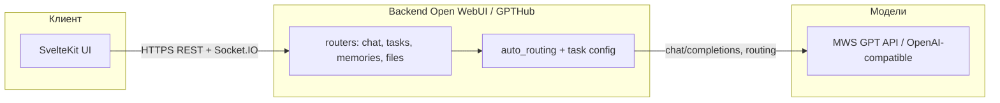

# GPTHub / VibeHub — единое ИИ-пространство

[](https://github.com/IT-AUL/true-tech-hack-2026/actions/workflows/ci.yml)
[](https://github.com/IT-AUL/true-tech-hack-2026/releases/latest)
[](https://github.com/open-webui/open-webui)
[](LICENSE)
[](https://hub.docker.com/r/itaul/gpthub)
[](#деплой-для-компаний-self-hosted)

[](https://kit.svelte.dev/)
[](https://fastapi.tiangolo.com/)
[](https://python.org/)
[](https://typescriptlang.org/)
[](https://tailwindcss.com/)

> Форк [Open WebUI](https://github.com/open-webui/open-webui), доработанный до **единого рабочего пространства с ИИ**: один интерфейс для диалогов, файлов, мультимодальных моделей и фоновых задач (титулы, теги, follow-up). Все запросы к LLM идут через **OpenAI-совместимый API** (в проде — MWS GPT и выбранные эндпоинты из конфигурации).

## Позиционирование

- **Один вход для команды** — чат, модели, память, загрузка документов и сценарии «задача → ответ» без переключения между разными тулзами.
- **Умная маршрутизация** — бэкенд классифицирует намерение и подбирает модальность (текст, код, картинка, поиск и т.д.); пользователь может оставить режим **Авто** или выбрать профиль задачи в workspace.
- **Контроль данных** — готовый **self-hosted** сценарий: образы в GHCR и Docker Hub, деплой на свою инфраструктуру, ключи и `OPENAI_API_BASE_URL` только у вас.

## Архитектура (кратко)



| Слой | Роль |
|------|------|
| **Frontend (`src/`)** | SvelteKit 2, чат, подсказки в поле ввода, выбор моделей и режимов задачи, workspace. |
| **Backend (`backend/open_webui/`)** | FastAPI: прокси к моделям, `/api/v1/tasks/*` (автодополнение, теги, follow-up), память, RAG. |
| **Маршрутизация** | `utils/auto_routing.py` + конфиг задач — выбор модели под тип запроса. |
| **Данные** | SQLite по умолчанию; опционально PostgreSQL; векторное хранилище для RAG/памяти. |

Репозиторий и CI ведутся в **GitHub**; зеркало `main` на GitLab — см. [docs/GITLAB_SETUP.md](docs/GITLAB_SETUP.md).

---

## Демо для жюри

**Сайт:** [https://mtshack.it-aul.ru](https://mtshack.it-aul.ru)

Тестовый доступ (только для проверки на хакатоне; после мероприятия пароль рекомендуется сменить):

| Поле | Значение |
|------|----------|
| **Email** | `demo-admin@mtshack.it-aul.ru` |
| **Пароль** | `DemoMtshack2026!` |
| **Роль** | admin |

**Что можно потестить на стенде**

- Чат с моделью **Auto** и ручной выбор моделей из списка.
- Сценарии с картинками/файлами (если включено на сервере).
- Подсказки и автодополнение в поле ввода, follow-up и вспомогательные задачи бэкенда.
- Админские разделы (модели, пользователи — по политике стенда).

---

## Возможности продукта

- **Мультимодальный чат** — текст, голос, изображения, файлы, аудио в одном интерфейсе.
- **Авто-маршрутизация** — выбор подходящей модели (LLM / VLM / ASR / генерация изображений и т.д.).
- **Ручной выбор модели и режима задачи** — переключение в любой момент.
- **Долгосрочная память** — контекст и факты о пользователе между сессиями (при включённой памяти).
- **Веб-поиск и работа с контентом** — по настройкам инстанса.
- **Self-hosted** — развёртывание на своих мощностях.

## Быстрый старт (локально)

```bash
# Клонировать (основной репозиторий — GitHub)
git clone https://github.com/IT-AUL/true-tech-hack-2026.git
cd true-tech-hack-2026

# Подготовить переменные (шаблон для прода — deploy/.env.example)
cp deploy/.env.example .env
# Обязательно задать в .env:
#   OPENAI_API_KEY           — ключ MWS / OpenAI-совместимого API
#   OPENAI_API_BASE_URL      — например https://api.gpt.mws.ru/v1
#   WEBUI_SECRET_KEY         — случайная строка для сессий

# Запуск одной командой (подхватит .env из корня)
OPENAI_API_KEY=<your-key> docker compose -f docker-compose.dev.yml up --build
```

Приложение: **http://localhost:3000** (порт задаётся `PORT` в `.env`, по умолчанию 3000).

### Минимальный набор переменных для разработки

| Переменная | Назначение |
|------------|------------|
| `OPENAI_API_KEY` | Ключ к API моделей (обязательно). |
| `OPENAI_API_BASE_URL` | База OpenAI-совместимого API (например MWS: `https://api.gpt.mws.ru/v1`). |
| `WEBUI_SECRET_KEY` | Секрет сессий; в dev в compose есть дефолт — для публичного стенда задайте свой. |
| `ENABLE_OLLAMA_API` | `false`, если Ollama не используется (уменьшает шум в логах). |

Роуты API наследуются от Open WebUI; кастомные эндпоинты форка — под префиксом `/api/v1/` (см. [docs/API_CHANGES.md](docs/API_CHANGES.md)).

## Образы Docker: GitHub Container Registry и Docker Hub

При пуше **git-тега** вида `v0.8.12-gpthub.N` CI собирает образ и публикует теги **в двух реестрах**:

| Реестр | Пример образа | Примечание |
|--------|----------------|------------|
| **GHCR** | `ghcr.io/it-aul/true-tech-hack-2026:<версия>` | Привязан к [репозиторию GitHub](https://github.com/IT-AUL/true-tech-hack-2026/pkgs/container/true-tech-hack-2026); удобно для CI и деплоя с `GITHUB_TOKEN`. |
| **Docker Hub** | `itaul/gpthub:<версия>` | Публичные pull’ы, знакомый UX `docker pull`; учётная запись организации задаётся секретами `DOCKERHUB_*` в CI. |

Также публикуются теги `:latest` на успешной сборке. Актуальная версия в бейдже **release** вверху README и в [Releases](https://github.com/IT-AUL/true-tech-hack-2026/releases).

## Разработка

### Требования

- Node.js 22+
- Python 3.11+
- Docker & Docker Compose v2

### Локальный запуск без Docker (два терминала)

**Backend:**

```bash
cd backend
pip install -r requirements.txt
bash start.sh
```

**Frontend:**

```bash
npm ci
npm run dev
```

### Линтинг

```bash
# Frontend
npx eslint . --max-warnings=0
npx prettier --check "src/**/*.{js,ts,svelte,css,json}"

# Backend
ruff check backend/
ruff format --check backend/

# Проверка типов (frontend)
npm run check
```

### Pre-commit хуки

Конфиг в `.pre-commit-config.yaml` **не подключается сам**: пока не выполнишь `pre-commit install`, при `git commit` ничего не запустится.

```bash
brew install ruff pipx
pipx install pre-commit
pre-commit install       # один раз в корне репозитория
```

Ruff в хуках идёт как **`ruff` в PATH** (без отдельного Python-окружения под Ruff). Сам `pre-commit` лучше ставить через **pipx**, чтобы не зависеть от поломанного Homebrew Python 3.14 у `brew install pre-commit`.

Проверить: `test -f .git/hooks/pre-commit && echo OK` — должен вывести `OK`.

## Деплой для компаний (self-hosted)

```bash
sudo mkdir -p /opt/gpthub
cp deploy/.env.example /opt/gpthub/.env
# Отредактируйте /opt/gpthub/.env — укажите OPENAI_API_KEY и WEBUI_SECRET_KEY
bash deploy/deploy.sh
```

Для демо-стенда на VPS с self-hosted runner используйте workflow **Deploy Demo** в GitHub Actions: release-пайплайн публикует образ, **Deploy Demo** вручную выкатывает нужную `version` или полный `image` на сервер.

Подробнее: [deploy/DEPLOY.md](deploy/DEPLOY.md)

## Версионирование и релизы

Формат: `0.8.12-gpthub.N` — база Open WebUI + номер релиза форка. Подробнее: [docs/VERSIONING.md](docs/VERSIONING.md).

```bash
npm run release   # интерактивный выбор версии → коммит → тег → пуш
```

## Структура проекта

```
├── src/                    # Frontend (SvelteKit 2 + Svelte 5 + Tailwind)
│   ├── lib/components/     #   UI-компоненты
│   ├── lib/apis/           #   API-клиенты
│   ├── lib/stores/         #   Svelte stores
│   └── routes/             #   Страницы
├── backend/                # Backend (FastAPI + Python 3.11)
│   └── open_webui/
│       ├── main.py         #   Точка входа
│       ├── routers/        #   REST API endpoints
│       ├── models/         #   SQLAlchemy ORM
│       ├── utils/          #   Chat pipeline, routing, auth
│       └── retrieval/      #   RAG и векторный поиск
├── deploy/                 # Self-hosted deployment
├── docs/                   # Документация API-изменений
├── .gitlab-ci.yml          # CI/CD pipeline (зеркало)
├── docker-compose.dev.yml  # Compose для разработки
└── docker-compose.yaml     # Compose по умолчанию (GPTHub + внешний API)
```

## Команда

| Роль | Область | Ключевые файлы |
|------|---------|-----------------|
| Frontend | `src/` | Компоненты чата, ModelSelector, мультимодальный ввод |
| Backend | `backend/` | Роутеры, маршрутизация моделей, API интеграция |
| MLOps | Docker, память, RAG | docker-compose, memories, retrieval |

## Ветвление и workflow

- `main` — стабильные релизы (защищённая ветка)
- `develop` — интеграция фич
- `feat/<область>/<описание>` — feature-ветки

Полный workflow: **[docs/WORKFLOW.md](docs/WORKFLOW.md)**

## API бекенда моделей (MWS)

OpenAI-совместимый endpoint (настраивается через `OPENAI_API_BASE_URL`):

- Пример базы: `https://api.gpt.mws.ru/v1`
- Типичные пути: `/models`, `/chat/completions`, `/completions`, `/embeddings`

## Лицензия

Основано на Open WebUI. См. [LICENSE](LICENSE).
