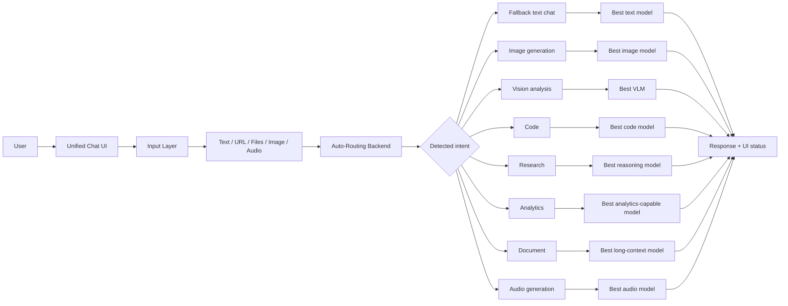
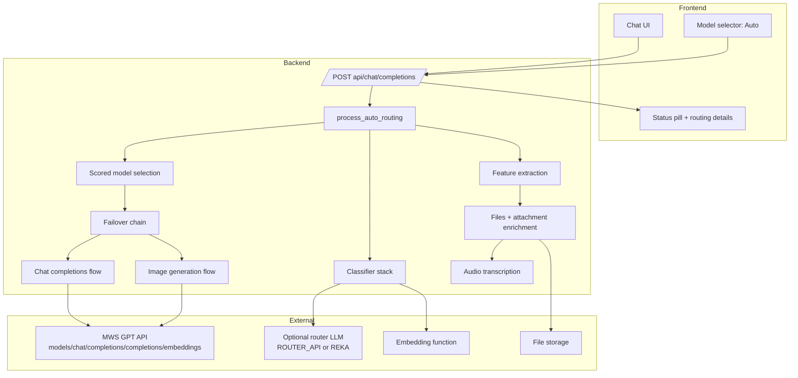
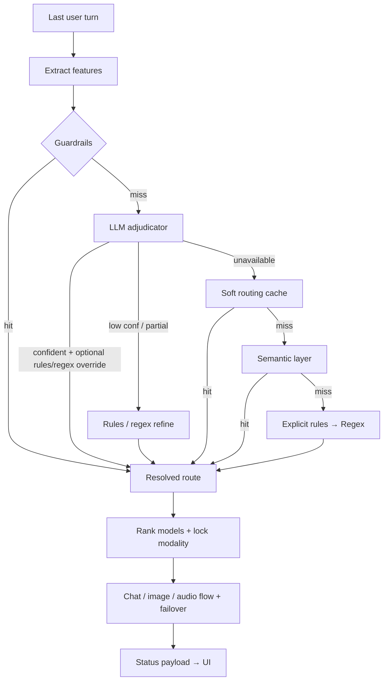

# GPTHub / VibeHub Auto-Routing Brief

Материал для дизайнера и презентации. Концентрированная версия инженерной ценности форка: как работает единый чат, почему auto-routing можно считать production-ready оркестратором, что видит пользователь, какие сценарии поддержаны, какие модели и внешние сервисы участвуют, и какие улучшения уже внедрены.

**Актуальный код:** `backend/open_webui/utils/auto_routing.py`. По умолчанию включён **enterprise**-движок; **legacy**-пайплайн остаётся для сравнения (shadow) или принудительного режима через конфиг роутера.

## 1. Что это за форк

`GPTHub` - это форк `Open WebUI`, эволюционировавший в единое AI workspace с одним чатом для разных типов задач:

- обычный текстовый диалог
- генерация изображений
- анализ изображений
- код и отладка
- research и web-based сценарии
- анализ документов и файлов
- аналитика данных
- транскрибация аудио

Ключевая идея форка: убрать ручной "режимный" UX. Пользователь работает в одном чате, а платформа сама определяет интент, назначает оптимальный маршрут по моделям и прозрачно объясняет выбор в интерфейсе.

## 2. Что важно показать в презентации

- Один интерфейс покрывает multimodal и multi-task сценарии без переключения экранов и ручных пресетов.
- `Auto` - это не "магический переключатель", а полноценный слой оркестрации поверх runtime-каталога моделей.
- Маршрутизация учитывает текст, файлы, изображения, аудио, URL и диалоговый контекст, включая короткие follow-up реплики.
- При сбое провайдера система не деградирует в хаотичный fallback, а делает контролируемый failover в рамках релевантной модальности.
- Пользователь получает объяснимый выбор: категория, модель, метод, stage, confidence и reasoning в status-слое UI.

## 3. User Flow: единый чат -> нужный AI-сценарий

## 4. Контур сервисов и моделей

## 5. Логика auto-routing (enterprise, упрощённо)

Цепочка соответствует `get_auto_routed_route` → `_get_auto_routed_route_enterprise`:

1. Извлечь признаки из последнего user-turn (текст, вложения, URL, контекст).
2. **Guardrails** — детерминированные сигналы (пустой запрос, явная мультимодальность и т.п.).
3. **LLM adjudicator** (если разрешён движком) — категория и reasoning от роутер-модели; при уверенном ответе возможны **override** явными правилами / regex, если они лучше ловят намерение (например «создай картинку»).
4. При низкой уверенности LLM — те же правила/regex могут уточнить маршрут.
5. **Кеш** маршрутизации (мягкий порог confidence).
6. Короткий **small-talk follow-up** в диалоге, если LLM недоступен.
7. **Semantic layer** (эмбеддинги / похожесть к примерам категорий).
8. **Explicit rules**, затем **regex** как финальная страховка.

После фиксации категории — ранжирование моделей из runtime-каталога, **failover** внутри той же модальности, эмит статуса в UI.

## 6. Поддерживаемые сценарии

| Пользовательский сценарий | Route category | Что делает система | Что стоит показать в UI |
|---|---|---|---|
| Обычный вопрос, small talk, общение | `fallback` | Выбирает лучшую text model | pill `✨ Текстовый ответ`, название реальной модели |
| "Создай картинку", "Нарисуй..." | `image_gen` | Отправляет запрос в настоящий image-generation flow | pill `🎨 Генерация изображения`, image loading state, результат как файл/картинка |
| "Что на фото?" + image attach | `vision` | Отправляет в VLM | pill `👁️ Анализ изображения` |
| Код, баг, endpoint, рефакторинг | `code` | Выбирает code-capable model | pill `⌨️ Написание кода` |
| Математика, логика, формулы | `math_logic` | Выбирает reasoning-heavy model | pill `📐 Математика и логика` |
| "Сравни", "Изучи", "Сделай обзор" | `research` | Выбирает research/reasoning model, может работать с URL | pill `🔍 Исследование и анализ` |
| CSV, таблица, метрики, dataset | `analytics` | Выбирает analytics-capable model | pill `📊 Анализ данных` |
| PDF, договор, текст файла | `document` | Направляет в document/long-context сценарий | pill `📄 Работа с документом` |
| "Создай музыку", "Сгенерируй звук" | `audio_gen` | Выбирает audio generation model | pill `🎵 Генерация аудио` |

## 7. Как система понимает запрос

На входе учитываются:

- последний user message
- предыдущий диалоговый контекст
- наличие image/audio/files
- наличие URL
- code blocks
- длина и язык запроса

Что важно:

- короткие, но осмысленные запросы не должны рано падать в `fallback`
- follow-up реплики в диалоге должны интерпретироваться с учетом контекста
- multimodal вложения должны влиять только на актуальный user turn

## 8. Какие модели используются

Важно для презентации: `Auto` не зашит на одну модель. Система берет runtime-каталог `OPENAI_MODELS` и выбирает лучший кандидат по категории, tier и failover-цепочке.

### Группы моделей по категориям

| Категория | Предпочитаемые семейства |
|---|---|
| `fallback` | `qwen`, `gpt`, `claude`, `llama`, `mistral`, `gemini`, `hermes`, `deepseek` |
| `image_gen` | `flux`, `gpt-image`, `dall-e`, `imagen`, `qwen-image`, `sd3`, `sdxl`, `z-image` |
| `vision` | `gpt-4o`, `gpt-5`, `grok-4`, `cotype-pro-vl`, `claude-4.5/4.6`, `gemini`, другие VLM |
| `code` | `kodify`, `codestral`, `devstral`, `deepseek-coder`, `qwen3-coder` |
| `research` | `qwen3-235b`, `qwen3-max`, `gpt-5`, `claude-opus`, `deepseek-chat`, `cogito`, `qwen3-next-80b` |
| `math_logic` | `qwen3-235b`, `qwen3-next-80b`, `deepseek`, `gpt-5`, `claude-opus`, `thinking` |
| `analytics` | `qwen3-235b`, `deepseek`, `gpt-5`, `claude`, `qwen` |
| `creative` | `claude-opus`, `gpt-5`, `qwen3-235b`, `hermes`, `claude` |
| `document` | `qwen3-235b`, `gpt-5`, `claude`, `qwen3-next-80b`, `deepseek` |
| `audio_gen` | `lyria`, `music`, `audio-gen` |

### Принцип выбора модели

- сначала определяется `category`
- затем учитывается `complexity` (`low`, `medium`, `high`)
- затем строится ranked list кандидатов
- потом включается failover, если провайдер недоступен
- для `image_gen` и `audio_gen` failover остается внутри той же модальности

## 9. Внешние зависимости

| Зависимость | Роль |
|---|---|
| `MWS GPT API` | Основной OpenAI-compatible backend для `/models`, `/chat/completions`, `/completions`, `/embeddings` |
| `Optional ROUTER API / REKA` | Внешний LLM-арбитр для ambiguous запросов |
| `Embedding function` | Semantic route layer |
| `File storage` | Доступ к uploaded files |
| `Audio transcription` | Извлекает текст из audio/video вложений |
| `Web / URL ingestion` | Поддержка research-сценариев с ссылками |

## 10. Что видит пользователь в интерфейсе

### Базовые UX-сигналы

- в селекторе есть виртуальная модель `Auto`
- в ответе показывается не просто `Auto`, а реальная выбранная модель
- под ответом показывается routing status pill
- в status можно показать category, reasoning, stage, confidence
- для image generation есть отдельный loading skeleton и отдельный flow результата

### UI-компоненты, которые уже есть

| Элемент | Что делает |
|---|---|
| `Auto` в model selector | включает интеллектуальную маршрутизацию |
| routing status pill | показывает выбранную категорию и модельный путь |
| emoji category marker | быстро объясняет тип сценария: `🎨 ⌨️ 👁️ 🎵 📐 🔍 📊 ✍️ 📄 ✨` |
| model name in response header | делает авто-выбор прозрачным для пользователя |
| image skeleton | визуально отделяет image-flow от text-flow |

### Что дизайнеру важно визуализировать

- один вход, много сценариев
- "умный роутинг" как видимая, но ненавязчивая часть UX
- объяснимость выбора модели
- failover как бесшовное поведение, а не ошибка для пользователя
- единый визуальный язык для text / image / vision / file / research

## 11. Главные улучшения форка по авто-роутингу

### Базовая эволюция

1. Добавлена виртуальная модель `Auto` прямо в UI.
2. Выбор моделей перестал зависеть от hardcoded model IDs и перешел на runtime catalog.
3. Статус авто-роутинга стал видим в интерфейсе.

### Улучшения логики

1. Enterprise-пайплайн: `guardrails → LLM adjudicator → при необходимости override правилами/regex → кеш → semantic → explicit rules → regex`; legacy остаётся за флагом для shadow-режима.
2. Узкий `small-talk short-circuit` / follow-up в диалоге: короткие осмысленные запросы не уходят преждевременно в «пустой» fallback.
3. Контекст диалога добавлен в классификацию follow-up запросов.
4. Кэш роутинга учитывает контекст, URL и chat/message identity.
5. `metadata.files` применяются только к последнему user turn, чтобы старые вложения не ломали новый запрос.

### Улучшения multimodal

1. `image_gen` теперь идет в реальный image-generation flow, а не в обычный text chat.
2. Failover для `image_gen` и `audio_gen` заблокирован внутри своей модальности.
3. Audio/video attachment сами по себе больше не считаются запросом на генерацию музыки.

### Улучшения наблюдаемости

1. В status payload добавлены `category`, `model_id`, `model_name`, `method`, `stage`, `engine`, `confidence`, `reasoning`.
2. Пользователь видит реальную выбранную модель вместо абстрактного `Auto`.
3. Категории получили понятные визуальные ярлыки и emoji.

## 12. Последние важные фиксы в текущем кейсе

### Уже исправлено

- Явные запросы вроде `создай картинку` теперь детерминированно ловятся и в enterprise-routing path, а не падают в `fallback`, если semantic layer/LLM abstain.
- Роутинг image generation больше не деградирует в текстовый ответ.

### Что это значит для презентации

- система лучше распознает прямое намерение пользователя
- меньше ложных текстовых ответов там, где пользователь ждет картинку
- `Auto` выглядит не как "рандомный выбор", а как контролируемая оркестрация

## 13. Качество и валидация

Для offline-проверки есть deterministic eval:

- JSONL fixture со сценариями маршрутизации
- script для accuracy / confusion matrix / per-category metrics
- возможность смотреть method distribution по route pipeline

Для презентации это можно подать как:

- "роутинг не только работает, но и измеряется"
- "есть базовая eval-инфраструктура для regression контроля"

## 14. Рекомендованная структура 3-4 слайдов

### Слайд 1. Product story

- единый AI-chat вместо набора разрозненных режимов
- `Auto` сам определяет тип задачи
- пользователь получает нужный тип ответа без ручного выбора модели

### Слайд 2. User Flow

- вставить схему из раздела `User Flow`
- подписи: text, image, vision, files, audio, URL

### Слайд 3. Service contour

- вставить схему backend/external services
- отдельно подсветить `Auto-Routing Backend`
- отдельно подсветить `MWS GPT API`

### Слайд 4. Improvements

- runtime model selection
- semantic + LLM routing
- multimodal failover
- transparent UI status
- real image-generation handoff

## 15. Короткие формулировки для подписи на слайдах

- `Один чат -> много AI-сценариев`
- `Auto = orchestration layer, а не одна модель`
- `Маршрутизация понимает интент, контекст и вложения`
- `Failover прозрачен для пользователя`
- `Выбор модели объясним и видим в интерфейсе`

## 16. Позиционирование для сообщества

Что можно уверенно заявлять публично:

- Мы не "прикрутили авто-выбор", а построили оркестрационный слой над реальным модельным каталогом.
- Архитектура ориентирована на надежность: контролируемый failover, модальность не теряется при ретраях.
- Система объяснима: пользователь видит, как и почему выбрана модель.
- Логика проверяема: есть deterministic eval-контур для регрессий маршрутизации.
- UX и backend развиваются синхронно: улучшения роутинга сразу отражаются в интерфейсе статусов.

Формула месседжа для питча:

`GPTHub Auto-Routing = единый вход в AI-задачи + production-надежность + прозрачная explainability для пользователя`
